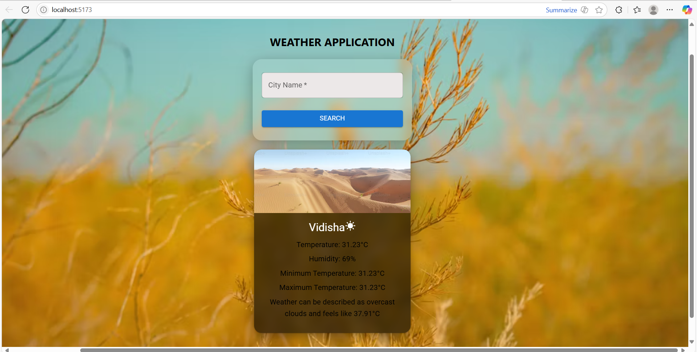
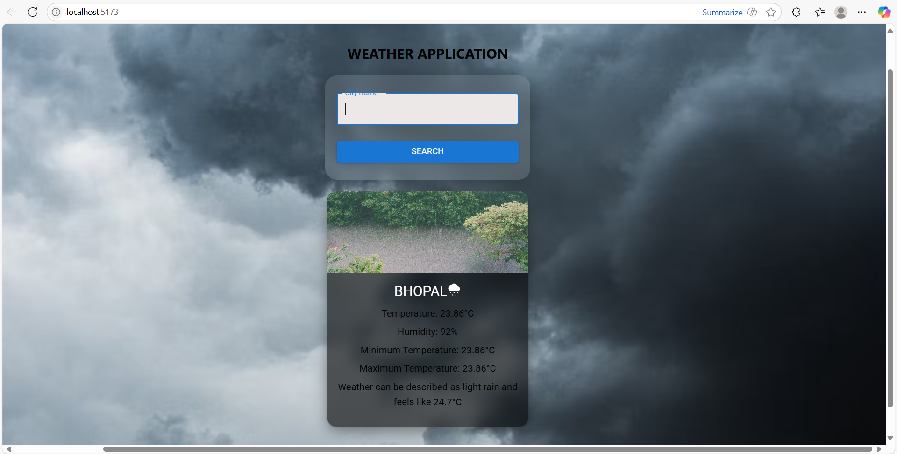

# 🌦️ Weather App

A simple and responsive weather application built with **React** that allows users to check real-time weather conditions for any city worldwide.  

## 🚀 Features
- 🌍 Search weather by city name  
- 🌡️ Displays temperature, humidity, and weather condition  
- 🎨 Clean UI with background that adapts to screen size  
- 📱 Fully responsive for mobile and desktop  
- ⚡ Powered by **OpenWeatherMap API**  

## 🛠️ Tech Stack
- **React.js**  
- **JavaScript (ES6+)**  
- **HTML5 & CSS3**    
- **API:** [OpenWeatherMap API] (https://openweathermap.org/api)  

## 📸 Screenshots

  
  
  

